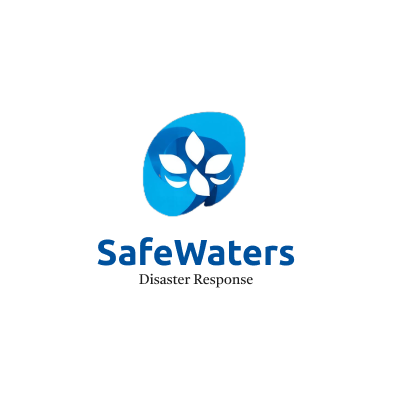
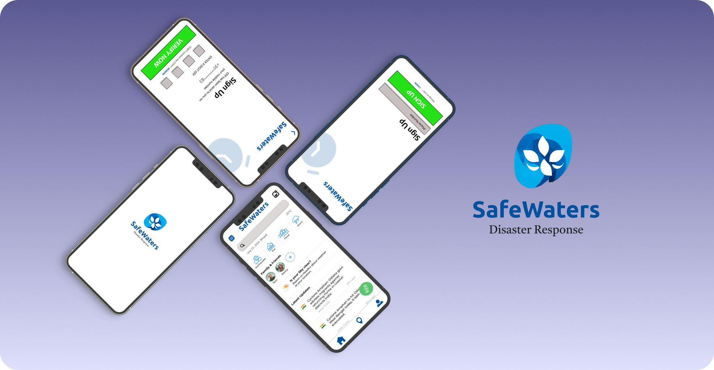

# SafeWaters

## AI-driven Disaster Response and Recovery

### Problem Statement

In the aftermath of a disaster, rapid response and efficient recovery are crucial to minimize the impact on affected communities. Traditional methods of assessing damage and coordinating relief efforts can be slow and resource-intensive. This project aims to develop an AI-driven system to automate and streamline the disaster response and recovery process, leveraging satellite imagery and other data sources to provide real-time insights and support decision-making.

### Understanding the Problem Statement

Disasters such as cyclones can cause widespread destruction, requiring immediate action to save lives and restore normalcy. In states like Odisha and West Bengal, cyclones have historically caused significant damage to infrastructure and livelihoods. This project aims to address the challenges faced during the aftermath of such disasters by utilizing AI to analyze satellite images and predict the extent of damage, helping officials to allocate resources more effectively.

### Brief Explanation of the Approach

Our approach involves using a combination of satellite imagery and machine learning techniques to develop a predictive model for assessing disaster impact. The model will classify images into different categories based on the severity of damage and provide actionable insights to aid in recovery efforts.

### Detailed Proposal

The project is divided into several key components:
1. Data Collection: Acquiring and preparing satellite imagery datasets.
2. Data Preprocessing: Cleaning and preprocessing the images and associated metadata.
3. Model Development: Building and training a CNN model for image classification.
4. Validation and Testing: Evaluating the model's performance on validation and test datasets.
5. Deployment: Integrating the model into a user-friendly interface for real-time monitoring and decision-making.

### Detailed Solution Approach

1. **Data Collection**: We use satellite imagery datasets that include images before and after a disaster, along with annotations describing the damage levels.
2. **Data Preprocessing**: Images are resized and normalized to ensure consistency. Labels are encoded to match the classification categories used in the model.
3. **Model Development**: A convolutional neural network (CNN) is designed to analyze the images and predict the damage category. The model is trained using labeled data and validated on a separate dataset.
4. **Validation and Testing**: The model's performance is evaluated using standard metrics like accuracy, precision, and recall. Predictions on new images are compared with ground truth to assess the model's reliability.
5. **Deployment**: The trained model is deployed as part of a mobile application prototype, providing real-time insights to disaster response teams.

### Tools and Devices Used in Development

- **Data Processing**: Python, OpenCV, pandas, numpy
- **Model Development**: TensorFlow, Keras
- **Data Visualization**: Matplotlib, Seaborn
- **User Interface**: Prototyped using design tools (Figma, Adobe XD)
- **Dashboard**: Qlik Insights for post-disaster impact visualization

### Technologies Involved

- Convolutional Neural Networks (CNN)
- Image Processing
- Machine Learning
- Data Visualization
- Cloud Computing (for model deployment)

### Dataset Description

The dataset used for this project includes satellite images categorized into different folders for training, validation, and testing. Each image is associated with a JSON file containing questions and ground truth labels describing the damage. This aligns with our project vision by providing the necessary data to train and validate our model, ensuring it can accurately predict disaster impact.

### Project Structure

The project is organized into the following folders:

- **Data**: Contains the post-disaster impact dashboard made using Qlik Insights and the dataset used for the dashboard (acquired from data.gov.in).
- **Model**: Contains the current state of the model development, including the code for preprocessing, training, and validation. It also includes a separate data exploration file that provides insights into the dataset.
- **UI**: Contains prototype design image ideas for the mobile application, which officials can use to monitor resource allocation and other critical information during disaster response.

#### Accessing the Files

- **Data**: 
  - [Dashboard](Data/Disaster Impact Dashboard.pdf) (Qlik Insights dashboard)
  - [Datasets](Data/Visualisation_Datasets) (Dataset used for the dashboard)
- **Model**: 
  - [Baseline Model](Model/Baseline_model.ipynb) (Current model development notebook)
  - [Understanding Dataset](Model/Understanding_dataset.ipynb) (Data exploration notebook)
- **UI**: 
  - [UI](UI) (Prototype design images for the mobile app)

### Getting Started

1. Clone the repository.
2. Navigate to the `model` folder and open `Baseline_model.ipynb` to start working on the model.
3. Use the `Understanding_dataset.ipynb` notebook to understand the dataset and preprocessing steps.
4. Refer to the `UI` folder for design ideas and integrate them into the final application.

## Future of the Solution

The future of this AI-driven disaster response and recovery system is promising, with significant potential to enhance real-time disaster management and resource allocation. By integrating real-time satellite data, the solution can provide immediate insights into the extent of damage following a disaster. This allows for rapid assessment and efficient distribution of resources to the areas most in need.

### Real-Time Satellite Data

Leveraging real-time satellite imagery, our solution can continuously monitor affected regions, identifying changes and updating damage assessments as new data becomes available. This capability is crucial for dynamic disaster environments where conditions can change rapidly, ensuring that response efforts are based on the most current information.

### Resource Allocation

By accurately predicting the extent of damage and identifying critical areas, the system can help disaster response teams allocate resources more effectively. This includes deploying medical supplies, food, water, and personnel to the locations where they are most needed, ultimately saving lives and accelerating recovery efforts.

### Model Enhancement

With adequate resources and further development, the performance of the model can be greatly enhanced. Additional training on larger and more diverse datasets, as well as the incorporation of advanced machine learning techniques, can improve the accuracy and reliability of predictions. Furthermore, integrating other data sources, such as social media reports and weather forecasts, can provide a more comprehensive view of the disaster impact.

### Potential Developments

- **Improved Accuracy**: Enhancing the model with more sophisticated algorithms and additional training data.
- **Scalability**: Ensuring the solution can handle large-scale disasters across multiple regions.
- **User Interface**: Developing a robust mobile application for real-time monitoring and decision-making.
- **Integration with Emergency Systems**: Linking the solution with existing emergency response systems for seamless operation.

Overall, this AI-driven solution has the potential to revolutionize disaster management by providing timely, accurate, and actionable insights, ultimately reducing the impact of disasters on affected communities.

## Contributing

We welcome contributions to improve this project. Please fork the repository and submit pull requests for any enhancements or bug fixes.

